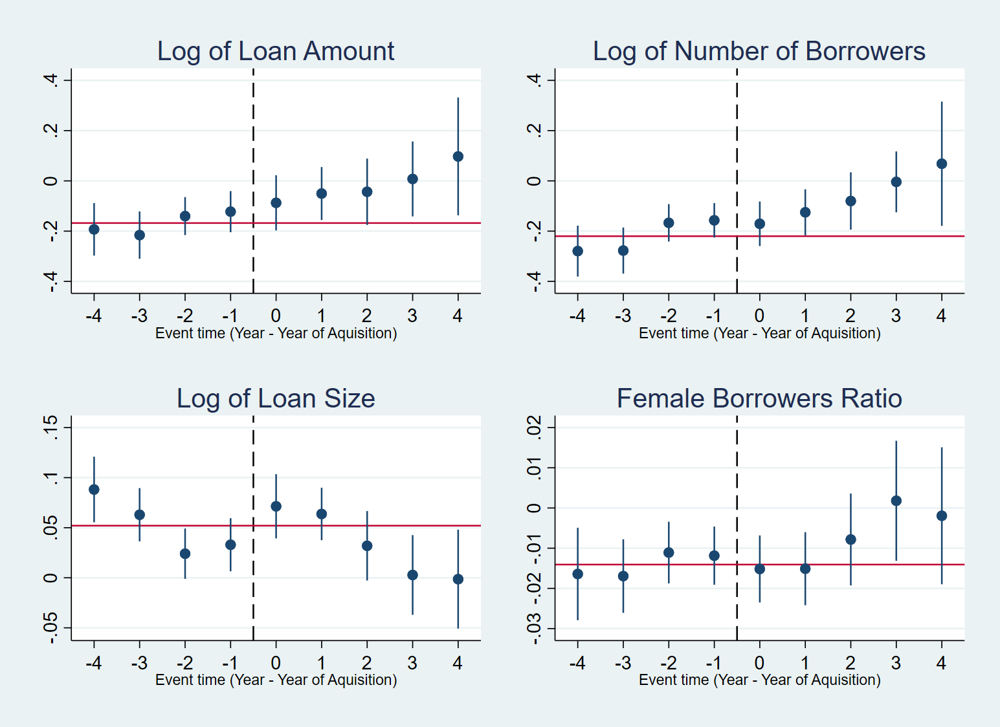

# Report of Effect of M&A on Lending Behavior of Microfinance Institutions

Daiju Aiba (JICA Ogata Research Institute)
 
 
August 2021
 
 

## 1. Introduction
In recent years, microfinance insitutions (MFIs) have palyed an important role in poverty allevaition thtough financial inclusion for developing countries. Along with the recent prosperity of MFIs, there are also a flood of capital inflow into them. The capital inflow takes various forms, such as debt and equity investment, and there exsit a variety of investers and lenders. According to El-zoghbi (2011) and Reille et al. (2011), those investors could be categorized into:
- Individuals
- Retail investors (Such as Oikocredit (Netherlands), responsAbility (Switzerland)), 
	- Retail investors represent 16 percent of the total stock of cross-border funding (Rellie et al., 2011).
- Institutional investors (Commercial banks, insurance companies, pension funds, private equity firm, and other corporate companies.)
- Development financial institutions (such as AECID, EBRD, IFC, KfW, and OPIC)      
    - The development financial institutions could be furhter devided into bilateral and multilateral entities.

 Generally, retail investors have big social goals. Although retail investor demand for microfinance is strong, its growth has been hampered by financial market regulations that do not allow microfinance investment funds distribution to the retail market in the United States and Europe (Rellie et al., 2011) Institutional investors are usually attracted by three features of microfinance, namely its social value, its perceived attractive risk-adjusted returns, and its potential negative correlation from other asset classes. Capital inflow from those investers have assisted the evolution of MFIs in developing countries.

In the meantime, there are several concerns of recent capital inflow into MFIs. Although capital inflow into MFIs have assisted financial inclusion, it could also encourage commercialization of MFIs and even foster mission drift. Particularly, merger & aquisition (M&A) of MFIs by private institutional investors have increased rapidly in recent years. Through M&A, the ownership and governamce mechanism of MFIs could be severely changed. Thus, the obejective of the MFIs could be distorted after the M&A cases.

In this study, we aim to empirically estimate the effect of M&A cases of MFIs on MFI lending behavoir, such as amounts of outstanding loans, and loan size per borrower, the total number of borrowers, and the ratio of female borrowers. For this purpose, we use a difference-in-difference approach, and employ the detailed data of MFI lending at MFI-district pair data from Cambodia Microfinance Association.   

 

## 2. Empirical Methodology 
### 2.1 Empirical Model
We use difference-in-difference approach for estimating the impact of M&A cases. Specifically, we use the following specification for the estimation.  
 

 
 

<!-- 
 $$ y_{ijt} = \Sigma_{k=-4}^{-1} \beta_{k} \times treat_{ik} + \Sigma_{k=0}^{4} \beta_{k} \times treat_{ik}+\gamma X_{it} + \mu_i+\nu_{jt} + \epsilon_{ijt} $$ 
-->

$treat_{ik}$ is a dummy variable taking one if observation periods relative to the group 
g ’s first treated period is the same value as k; 0 otherwise, and it also takes 0 for all never-treated groups. Estimation is  performed with standard errors clustered at a district level.  

Futhermore, we also examine the heterogenious impact of the M&A cases. The M&A cases could drive MFIs from proverty alleviation mission, and could increase loan provision to developed areas. To examine such changes in MFI lending behavior, we include the interactio terms of the treatment dummy with indicators of economic development. Specifically, we extened the model to the following specification.  

 

 

  

### 2.2 Data
For the estimation, we constrcuted the dataset from three sources. Firstly, the data relating to MFI lending is extracted from the CMA-NIX database. Secondly, the data represeting MFI's financial condition is extracted from the NBC Supervision Annual Report. Thirdly, we also collected the data of mergers and aquisitions in the Cambodian MFI sector via website of each MFI and local newspapers.
For collecting the data of merger and aquisition, 
 
Our dependent variables include the loan amount, total number of borrowers, loan size (ratio of the loan amount to the total number of borrowers), and ratio of female to the total number of borrowers. We take the logarithm form of all the outcome variables in our regression analysis.
  

### 2.3 Definition of M&A
The policy variables include indicators for M&A cases of MFIs. To empirically examine the effect of M&A, we employ three dummy and one share (fraction) indicators. We generate a dummy variable (MA0) with a value of 1 for MFIs in which foreign countries participate as shareholders based on the data from MFIs’ webpages and financial reports. Further, we construct two dummy indicators (MA1 and MA2), one taking 1 if the foreign share is non-zero and the other if the foreign share equals or exceeds 50 percent based on MFI-NBC data. Additionally, we take the ratio of foreign share directly as an alternative measure of M&A cases (MA3).
  

## 3. Results 
Table 1 shows the results of the estimation.

<figure>
    Figure 1 
    Note: A red-colored line in each panel represents the average of coefficients before the event.
</figure>

 
Next, we estimated the model of Equation 2, which includes the interaction terms of population density. Figure 2 shows the estimated coefficients of interaction terms of population density. 

 
<figure>
    Figure 2 Coefficients of Interaction terms of Population Density 
    Note: A red-colored line in each panel represents the average of coefficients before the event.
</figure>

