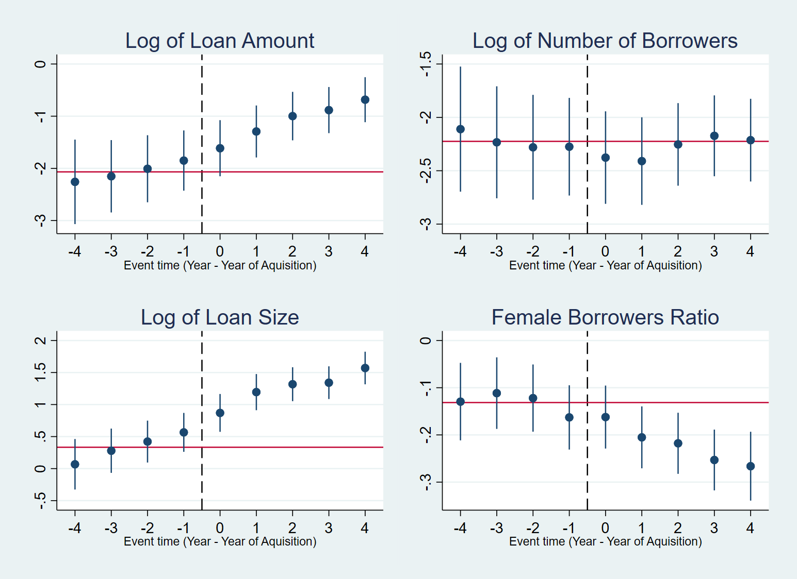

# Report of Effect of M&A on Lending Behavior of Microfinance Institutions

## 1. Objective and methodology of the study
We aim to empirically estimate the effect of merger and acquisition (M&A) cases of Microfinance institutions (MFIs) on loan amount and size, the total number of borrowers, and the ratio of female borrowers. For this purpose, we use a difference-in-difference approach whereby we exploit the variation in loan provision across MFIs and periods. To investigate the M&A effect, we employ MFIs data from the National Bank of Cambodia (MFI-NBC).  

 

## 2. Empirical Methodology 

### 2.1 Empirical Model

  

### 2.2 Data
For the estimation, we constrcuted the dataset from three sources. Firstly, the data relating to MFI lending is extracted from the CMA-NIX database. Secondly, the data represeting MFI's financial condition is extracted from the NBC Supervision Annual Report. Thirdly, we also collected the data of M&A in the Cambodian MFI sector via website of each MFI and local newspapers.
 
Our dependent variables include the loan amount, total number of borrowers, loan size (ratio of the loan amount to the total number of borrowers), and ratio of female to the total number of borrowers. We take the logarithm form of all the outcome variables in our regression analysis.
  

### 2.3 Definition of M&A
The policy variables include indicators for M&A cases of MFIs. To empirically examine the effect of M&A, we employ three dummy and one share (fraction) indicators. We generate a dummy variable (MA0) with a value of 1 for MFIs in which foreign countries participate as shareholders based on the data from MFIs’ webpages and financial reports. Further, we construct two dummy indicators (MA1 and MA2), one taking 1 if the foreign share is non-zero and the other if the foreign share equals or exceeds 50 percent based on MFI-NBC data. Additionally, we take the ratio of foreign share directly as an alternative measure of M&A cases (MA3).
  

## 3. Results 
Table 1 presents the effect of change in MFIs foreign share on loan-related indicators. Here, I construct the indicator for the change in foreign share (MA4) using the MFI-NBC data initially before merging with other data sets as you suggested last time. However, most of the coefficients are insignificant at the 5 percent significance level.

Table 2 presents the effect of M&A in MFIs on loan-related indicators. Unlike the previous case, I construct the indicator for the M&A (MA5) excluding those M&A cases before 2014 as you suggested last time. However, most of the estimates remain robust to those obtained including the cases before 2014. The result in column 1 shows that M&A positively affects the loan amount (increases by about 33 percent). After including the interactions in column 2, however, the estimate for M&A turns to be negative. Moving from less to the highly-populated area, however, M&A increases loan amount by 23 percent. Moreover, moving from low to high disaster incidence areas, M&A increases loan amount by approximately 70 percent. We observe similar results for the effect on the total number of borrowers. Loan size is affected positively by 24 percent as shown in column 5 before interacting M&A with population and disaster. Moreover, column 6 shows that M&A increases loan size as we move to densely populated areas and high disaster incidence areas. Finally, M&A decreases the ratio of females to a total number of borrowers as shown in columns 7 and 8.

